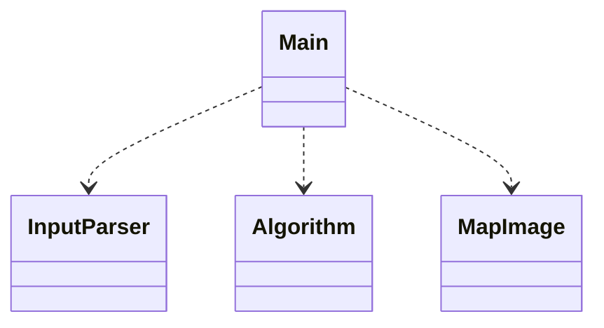

# Implementation
## Program structure

Program is divided into seven classes, and main executable file index.py. Short description of classes:
### MapImage
MapImage includes operations for creating MapImage object from input text file, adding routes and points to the image and saving the image to disk. Python Imaging Library (pillow) is used for image operations.
### Distance
Distance calculation algorithms are implemented with template method pattern. Distance class is superclass, which includes basic methods for creating shortest route and visited nodes, and skeleton methods for distance calculation and heuristic.
### Algorithm
Distance calculation algorithms are implemented with template method pattern. Algorithm class is superclass, which includes basic methods for creating shortest route and visited nodes, and skeleton methods for distance calculation and heuristic. Includes method also for running benchmark cases.
### Dijkstra, AStar and JPS 
These subclasses inherit the Distance class and overwrite its distance calculation method.
### Graph
Class that includes methods for graph manipulation and is used to convert map file to graph file format.
### Input parser
Class for parsing command line arguments.

## Algorithm implementations
Dijkstra and A* algorithm implementations are based on Tietorakenteet ja Algoritmit book and Wikipedia articles. JPS (jump point search) algorithm is based on Harabor and Grastien article. 2D grid is modelled as graph (python list of lists) where each node includes neighboring nodes and their distance (1 to horizontal and vertical direction, sqrt(2) to diagonal direction).

### Dijkstra
Algorithm uses python PriorityQueue for storing nodes to be calculated. Nodes are arranged based on their distance from start point, so that nodes with shortest distance from start are gone through first.

### A*
Algorithm is almost the same as Dijkstra, except heuristic function is included. Order in which nodes are to be calculated is based on the sum of distance from start to the current node and estimated distance from current node to the end (calculated with euclidean distance). Nodes with shortest total estimated distance are to be calculated first.

### Jump Point Search
Algorithm is quite similar to A*. Difference is that in A* all neighbors are considered for distance calculation, but in JPS only certain nodes, so called jump points, are calculated more extensively. There is additional processing where jump points are identified based on direction and if neighbor nodes are blocked or not. This processing is done with recursive jump method, which returns jump point if it is found, and is not computationally as expensive as distance calculation. 

## Sources
[Laaksonen, Antti "Tietorakenteet ja algoritmit" (2021)](https://github.com/hy-tira/tirakirja/raw/master/tirakirja.pdf)

[Dijkstra algorithm, Wikipedia](https://en.wikipedia.org/wiki/Dijkstra%27s_algorithm)

[A* algorithm, Wikipedia](https://en.wikipedia.org/wiki/A*_search_algorithm)

[Harabor, Daniel, and Alban Grastien. "Online graph pruning for pathfinding on grid maps." Proceedings of the AAAI Conference on Artificial Intelligence. Vol. 25. No. 1. 2011.](http://users.cecs.anu.edu.au/~dharabor/data/papers/harabor-grastien-aaai11.pdf)
