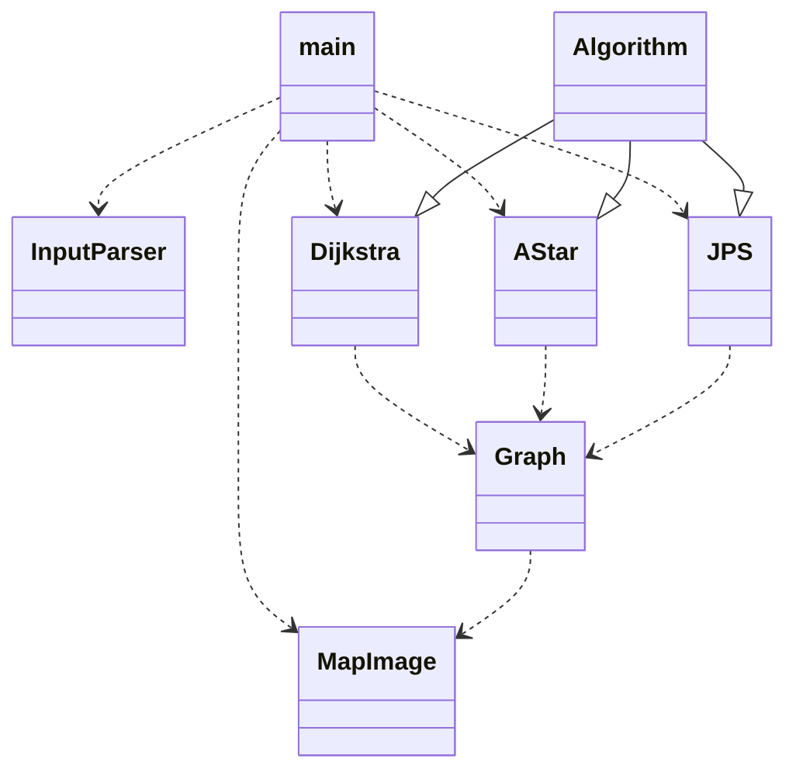

# Implementation
## Program structure

Program is divided into seven classes, and main executable file index.py. Short description of classes:
### MapImage
MapImage includes operations for creating MapImage object from input text file, adding routes and points to the image and saving an image to the disk. Python Imaging Library (pillow) is used for image operations.
### Algorithm
Distance calculation algorithms are implemented with template method pattern. Algorithm class is superclass, which includes basic methods for creating shortest route and visited nodes, and skeleton method for distance calculation. Includes method also for running benchmark cases.
### Dijkstra, AStar and JPS 
These subclasses inherit the Algorithm class and overwrite its distance calculation method.
### Graph
Class that includes methods for graph manipulation and is used to convert map file to graph file format.
### Input parser
Class for parsing command line arguments.

## Algorithm implementations
Dijkstra and A* algorithm implementations are based on Tietorakenteet ja Algoritmit book and Wikipedia articles. JPS (jump point search) algorithm is based on Harabor and Grastien article. 2D grid is modelled as adjacency matrix (python list of lists) where each node includes neighboring nodes and their distance (1 to horizontal and vertical direction, sqrt(2) to diagonal direction).

### Dijkstra
Algorithm uses python PriorityQueue for storing nodes to be calculated. PriorityQueue is build on Python heapq module, which is based on a binary heap Nodes are arranged in queue based on their distance from start point, so that nodes with shortest distance from start are gone through first:
```
queue.put((0,start)
while not queue.empty()                 # O(n)
    node = queue.get()                  # O(log n)  
    if closed[node]
        continue
    closed[node] = true
    for neighbor, dist in graph[node]   # O(8)
        old = distance[neighbor]
        new = distance[node]+dist
        if new < old
            distance[neighbor] = new
            queue.put((new, neighbor))  # O(log n)
```
In the case of 2D grid examined here, number of nodes in a graph is x * y = n, where x is number of nodes in horizontal direction and y in vertical direction. In worst case, all nodes are gone through in a while loop, which takes O(n) time. Inside one iteration, PriorityQueue get() method is called once (takes O(log n) time for binary heap). Then adjacent neighbor nodes are gone through inside for loop. There can be zero to eight neighbor nodes, so maximum number of iterations is 8. Inside this for loop, PriorityQueue put() method can be called once for each iteration, each function call taking O(log n) amount of time. Maximum total time used is O(n(log n + 8 log n)), which can be simplified to O(n(8 log n)) and further to O(n log n).

Largest data structure is a list inside a list, where nodes and their neighbors are stored. Space complexity is O(8n).

### A*
Algorithm is almost the same as Dijkstra, except heuristic function is included. Order in which nodes are to be calculated is based on the sum of distance from start to the current node and estimated distance from current node to the end (calculated with euclidean distance). Nodes with shortest total estimated distance are to be calculated first:
```
f_cost = distance_to_end(start)
queue.put(f_cost,start)
while not queue.empty()                 # O(n)
    node = queue.get()                  # O(log n)  
    if closed[node]
        continue
    closed[node] = true
    for neighbor, dist in graph[node]   # O(8)
        old = distance[neighbor]
        new = distance[node]+dist
        if new < old
            distance[neighbor] = new
            f_cost = new + distance_to_end(neighbor)
            queue.put((f_cost, neighbor))  # O(log n)
```
In comparison to Dijkstra, there is additional calculation to estimate distance from current node to the end. This is a simple calculation taking O(1) time, so it doesn't cause significant increase in calculation time. Theoretically maximum calculation time is the same O(n log n) as for Dijkstra, but on average the algorithm is faster because heuristic function ensures that nodes that are closer to the end are calculated first, so there will be less visited nodes in total. 

Space complexity is the same O(8n) as for Dijkstra.

### Jump Point Search
Algorithm is quite similar to A*. Difference is that in A* all neighbors are considered for distance calculation, but in JPS only certain nodes, so called jump points, are calculated more extensively. There is additional processing where jump points are identified based on direction and if neighbor nodes are blocked or not. This processing is done with recursive jump method, which returns jump point if it is found, and is not computationally as expensive as distance calculation:

## Performance analysis
Theoretical performance analysis and performance comparison between actual implemented algorithms to be added.

## Sources
[Laaksonen, Antti "Tietorakenteet ja algoritmit" (2021)](https://github.com/hy-tira/tirakirja/raw/master/tirakirja.pdf)

[Dijkstra algorithm, Wikipedia](https://en.wikipedia.org/wiki/Dijkstra%27s_algorithm)

[A* algorithm, Wikipedia](https://en.wikipedia.org/wiki/A*_search_algorithm)

[Harabor, Daniel, and Alban Grastien. "Online graph pruning for pathfinding on grid maps." Proceedings of the AAAI Conference on Artificial Intelligence. Vol. 25. No. 1. 2011.](http://users.cecs.anu.edu.au/~dharabor/data/papers/harabor-grastien-aaai11.pdf)
